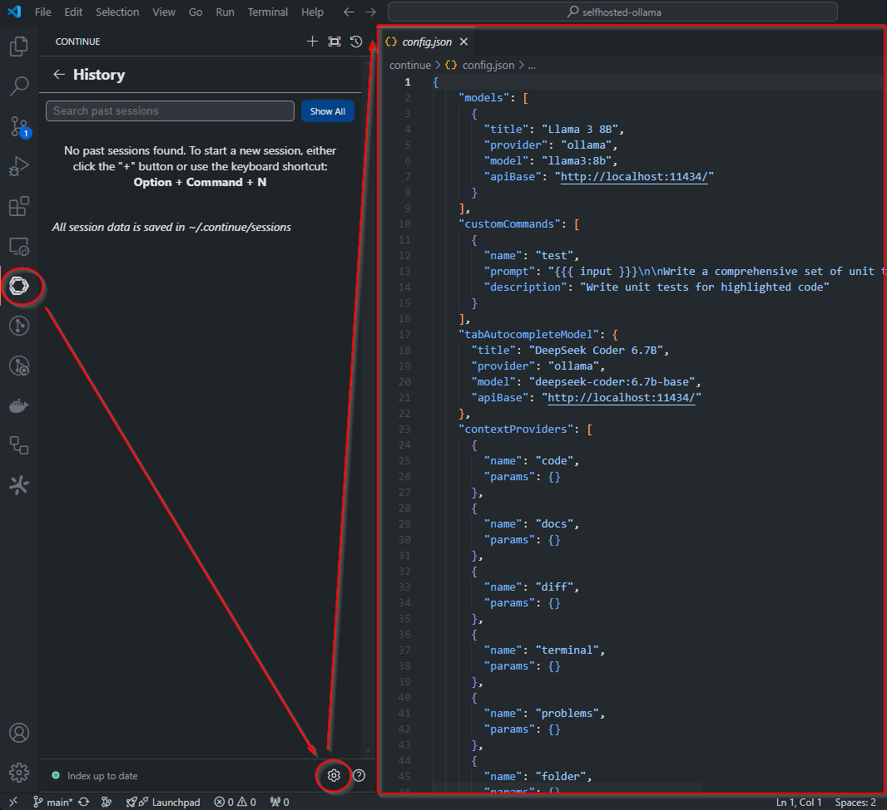
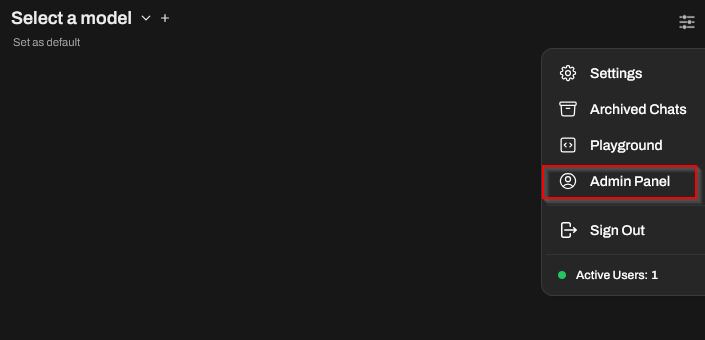
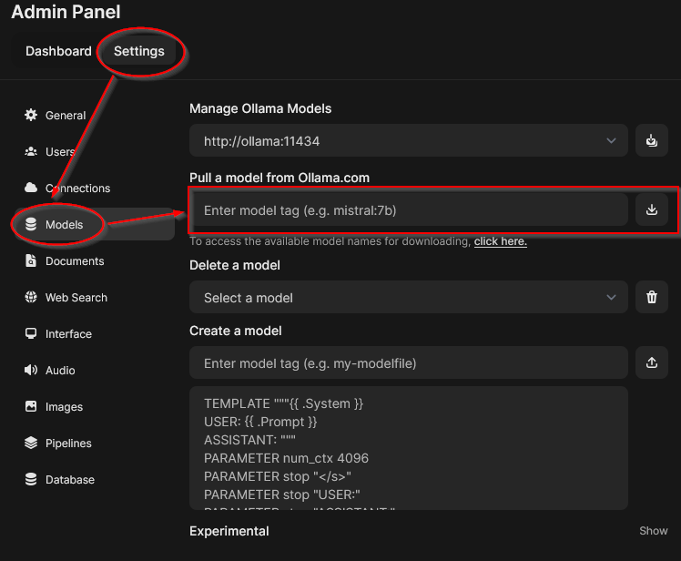

# Self-Hosted Ollama Code Assistant

This project provides a self-hosted alternative to GitHub Copilot using Ollama, Docker, and VS Code. It includes a Docker Compose setup for the Ollama WebUI and configuration for the "Continue" VS Code extension.

## Prerequisites

- Docker and Docker Compose
- Visual Studio Code
- Git

## Setup Instructions

1. Clone the repository:

```bash	
git clone https://github.com/xmaxcooking/selfhosted-ollama.git
cd selfhosted-ollama
```

2. Start the Ollama WebUI:

```bash	
docker-compose up -d
```

3. Install the [Continue VS Code extension](https://docs.continue.dev/quickstart):
- Open VS Code
- Go to the Extensions view (Ctrl+Shift+X)
- Search for "Continue"
- Install the pre-release version of the extension

4. Configure the "Continue" extension:
- Copy the provided settings file to the extension settings
- (You may want to provide more specific instructions on where to find and how to copy the settings file)



5. Access the Ollama WebUI:
- Open your browser and navigate to `http://localhost:8080`

6. Download required models:
- In the Ollama WebUI, go to the Admin Panel Settings



- Download the following models:
  - deepseek-coder:6.7b-base
  - llama3:8b
  - nomic-embed-text



7. Start coding with your new self-hosted code assistant!

## Usage

Alternative to using github copilot and cursor IDE.
 
 
 